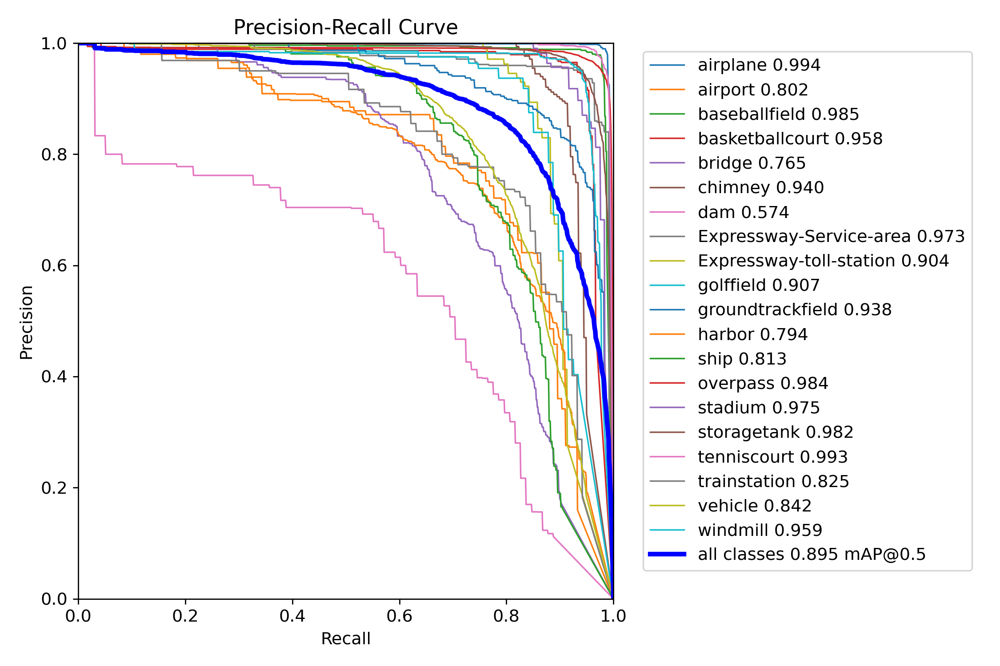
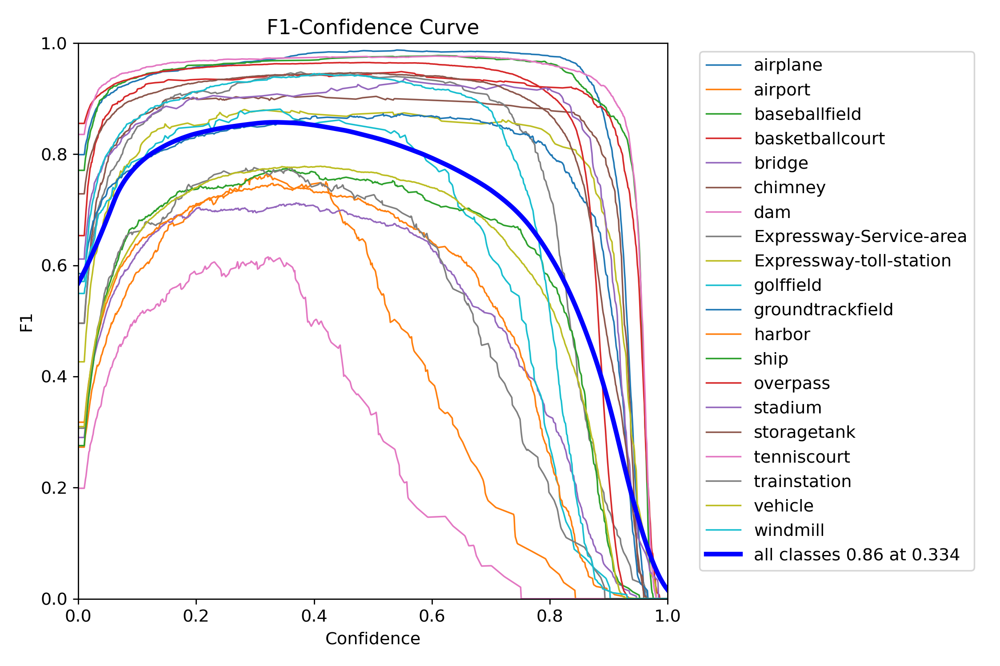
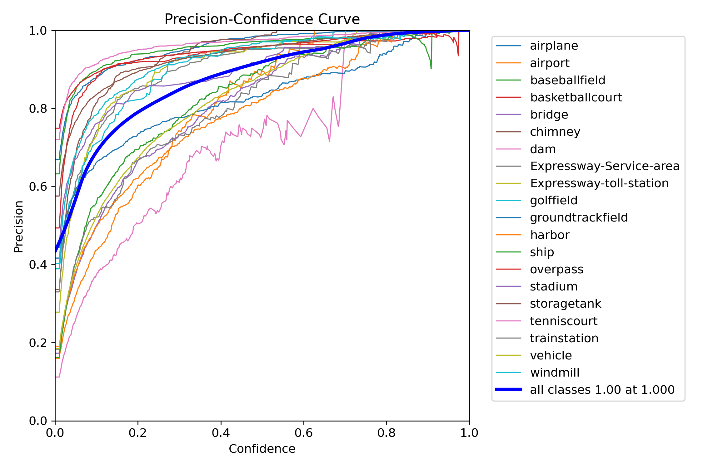
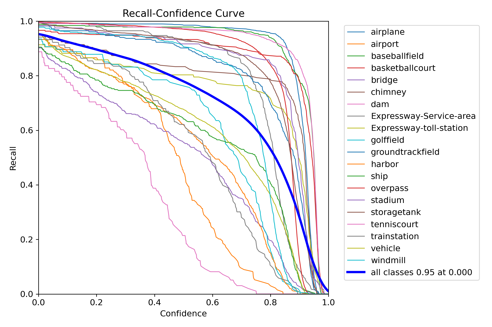
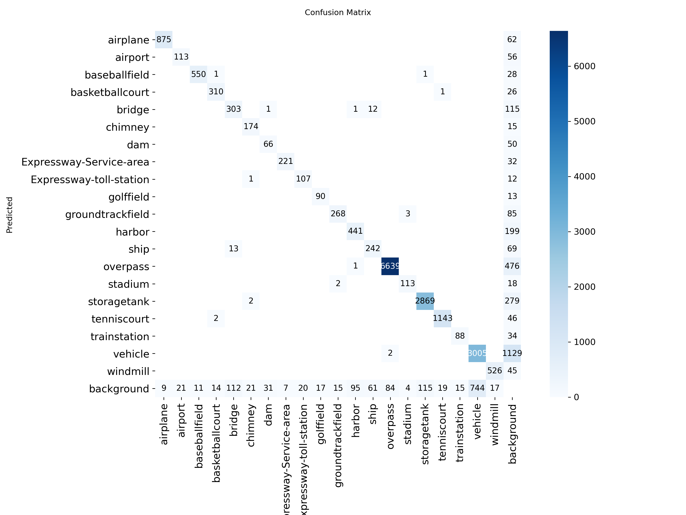
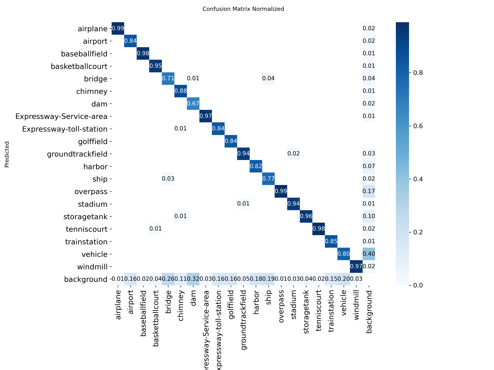
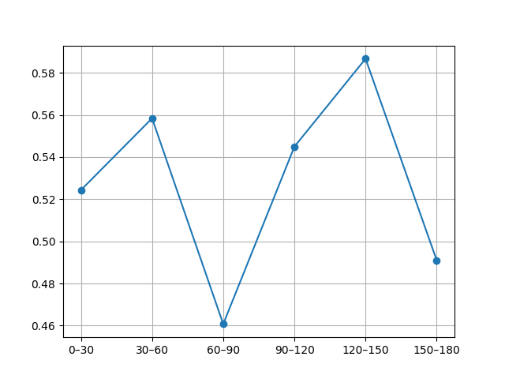
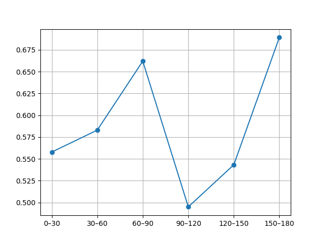
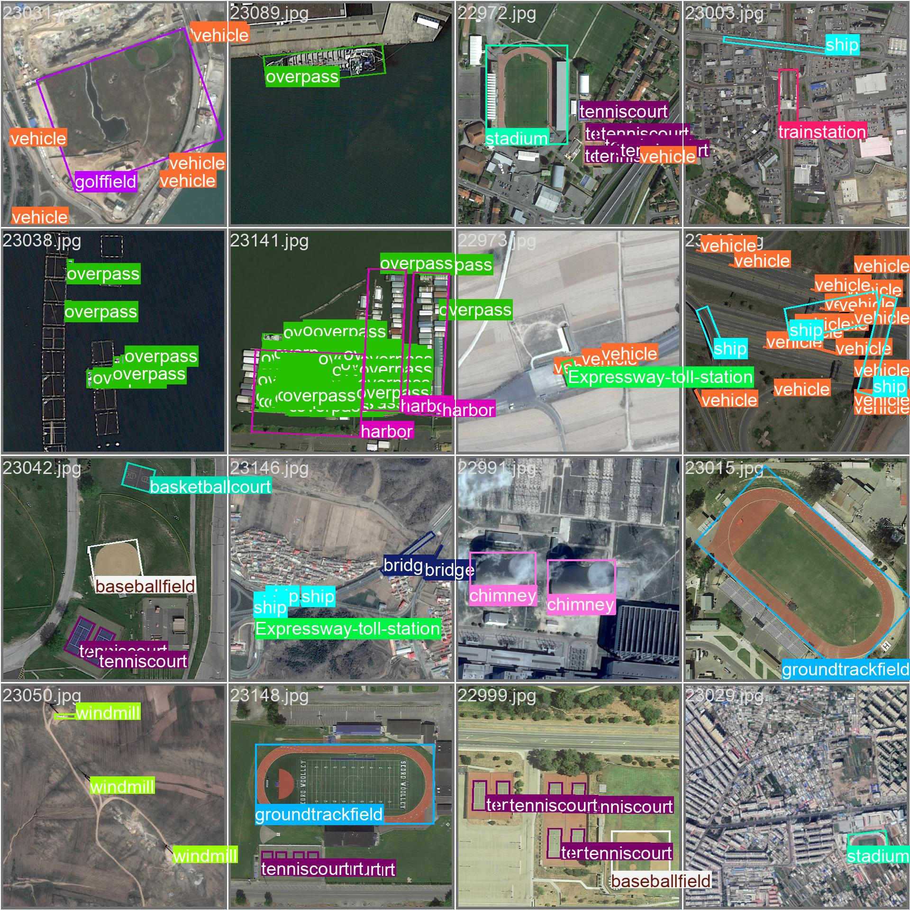

# Rotated Object Detection on DIOR-R (YOLOv8-OBB)

This project builds a rotated object detector on the **DIOR-R** aerial dataset using **Ultralytics YOLOv8 OBB**.
The goal is to *detect and classify objects with rotated bounding boxes* across diverse orientations.

## Dataset
- **DIOR-R (YOLO-OBB format)** downloaded via KaggleHub.
- Train/val split prepared under: `diorr_obb/` → `images/` and `labels/` for YOLO-OBB.
- Number of classes: 20 (e.g., airplane, overpass, storagetank, …).

## Model & Training
- Base: `yolov8s-obb.pt`/`yolov8m-obb.pt` (tested).
- Typical config: `imgsz=1152–1280`, `batch=6–8` (accumulate=2 if needed), `epochs=100–120`, `cos_lr=True`, `amp=True`.

## Results (Validation)
- **mAP50-95 ≈ 0.714**, **mAP@50 ≈ 0.895** (good performance on DIOR-R).
- Strong classes: airplane, baseballfield, basketballcourt, overpass, storagetank, tenniscourt, stadium, groundtrackfield, windmill.
- Challenging classes: dam, bridge, harbor, ship, airport, trainstation, vehicle.

### Curves & Confusion Matrix

### Angle-wise Performance
We analyze performance vs. object orientation (0–180° bins):
- Precision/Recall vary across angles; best around **120–150°**, lower around **60–90°** and **90–120°**.
- Plots:

### Qualitative Examples
Below are randomly sampled validation predictions (green=GT, red=Pred for FP/FN samples):

*(Optional)* Additional examples from FP/FN mining are saved under `assets/` if present.

## How to Reproduce
1. Open the Colab notebook, ensure GPU is enabled.
2. Run cells in order:
   - Mount + install → KaggleHub download → dataset prep → `data.yaml` → train → validate.
3. Save results to Drive:
   - `eval_summary.csv`, `eval_per_class.csv`, `precision_by_angle.png`, `recall_by_angle.png`, curves, confusion matrices.
4. (Optional) Run angle-wise analysis & FP/FN mining cells for detailed breakdown.

## Recommended Inference Threshold
From F1-Confidence analysis, a **confidence ≈ 0.33** is a strong operating point for all-classes.  
Per-class threshold tuning can further improve precision/recall trade-offs.

## Notes
- A few validation labels were reported as non-normalized/out-of-bounds and were ignored by the evaluator.
- For classes with lower AP (e.g., dam/harbor/ship/vehicle), consider orientation-focused augmentation and/or more data.