# Industrial Sensor Anomaly Detection — SMAP & MSL

**Global LSTM Autoencoder** with per-series fine-tuning, robust preprocessing, synthetic timestamps, a threshold strategy switch (*best-F1* / *precision-floor*), and rich per-series artifacts (metrics, plots, CSVs). A unified `ALL_EVENTS.csv` aggregates detected intervals across all series.

_Generated on:_ **2025-10-15 21:16:14**
## 1) Highlights
- **Modeling**: Global LSTM Autoencoder → light per-series fine-tune.
- **Scoring**: Blended top-k timewise & featurewise reconstruction errors on raw + first-difference signals, with smoothing.
- **Thresholding**:
  - `best_f1`: maximizes F1 on labeled windows (high recall),
  - `precision_floor`: enforces minimum precision, then maximizes recall,
  - unlabeled: train-score quantile (`TRAIN_ALERT_Q`).
- **Morphology**: remove short islands, merge gaps, optional dilation.
- **Outputs**: per-series metrics & plots, per-window CSVs, unified `ALL_EVENTS.csv`, run-level histograms & report.
## 2) Run Snapshot
- **Series with metrics (rows in batch_summary)**: 66

**Median metrics** (ignoring NaN):
- Precision: **0.099**
- Recall: **0.994**
- F1: **0.149**
- ROC AUC: **0.495**
- AUPRC: **0.062**

> Want fewer false alarms? Use `precision_floor` and increase `TARGET_PRECISION`.
## 3) Key Visuals
### 3.1 Training Loss (Global)
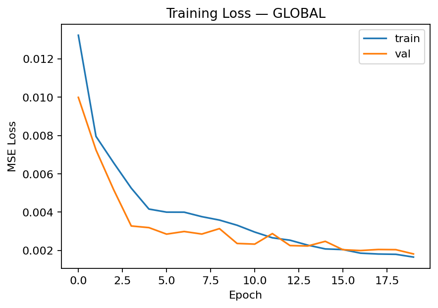

### 3.2 Score Distributions (Run-Level)
<table>
  <tr>
    <td>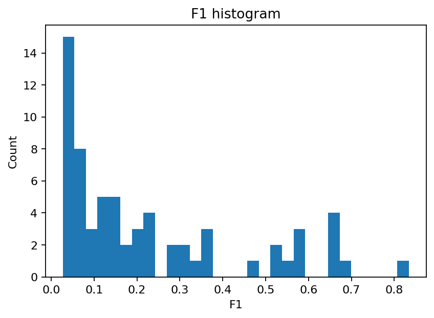</td>
    <td>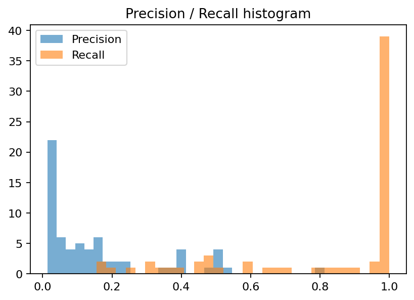</td>
  </tr>
  <tr>
    <td align="center"><em>F1 Histogram</em></td>
    <td align="center"><em>Precision/Recall Histogram</em></td>
  </tr>
</table>
### 3.3 A-9

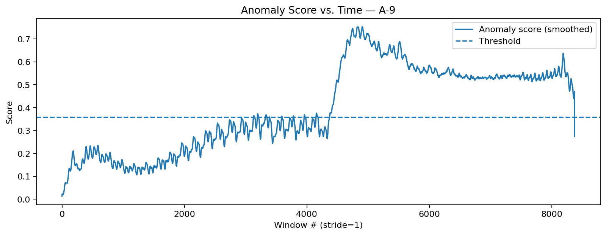

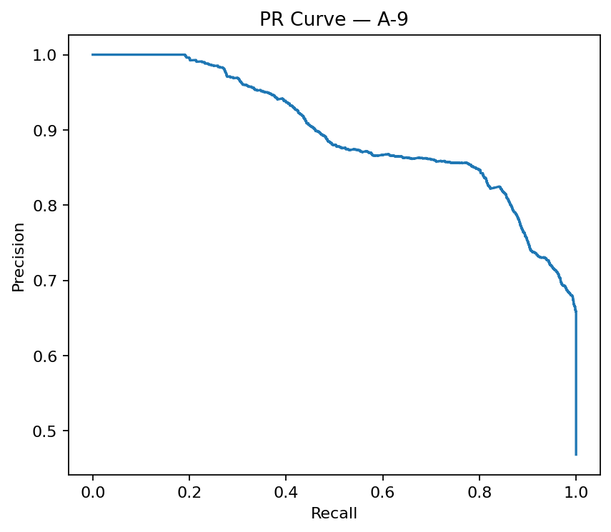

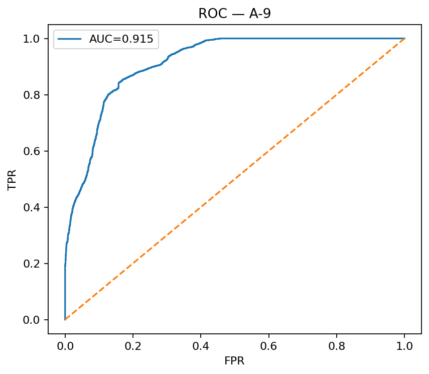

### 3.3 D-7

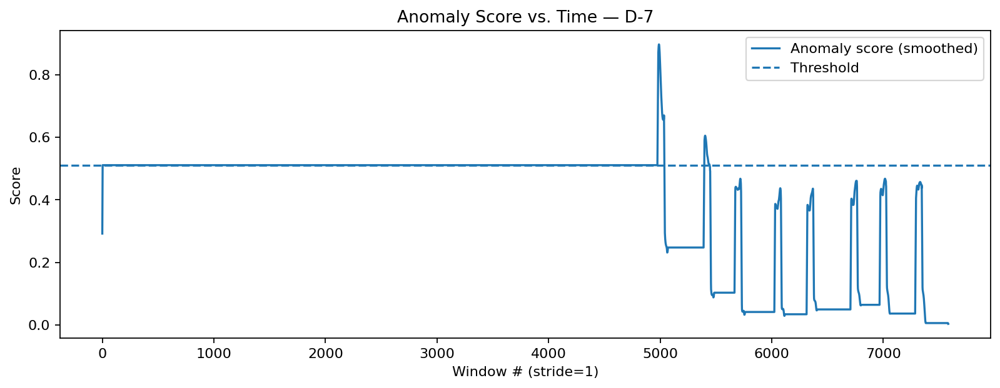

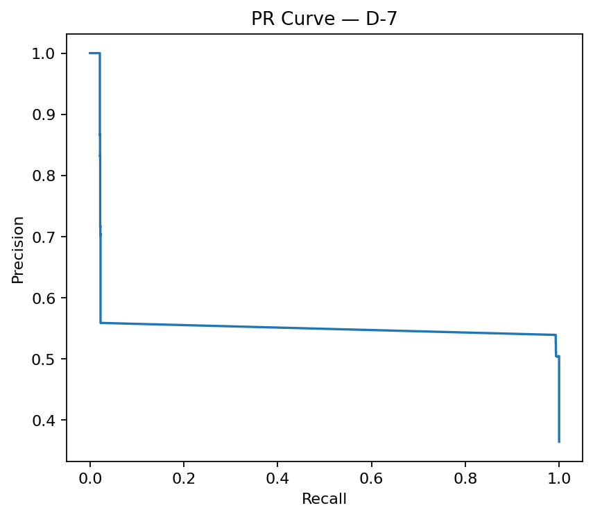

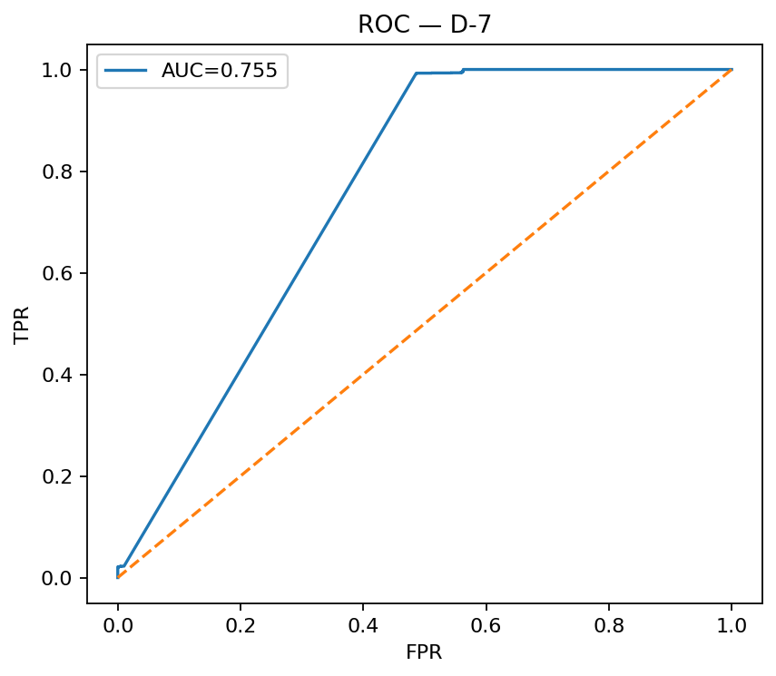

### 3.3 D-2

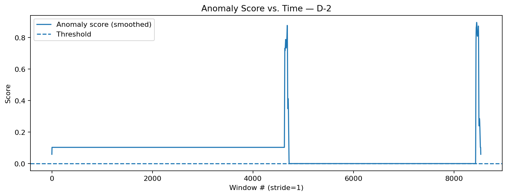

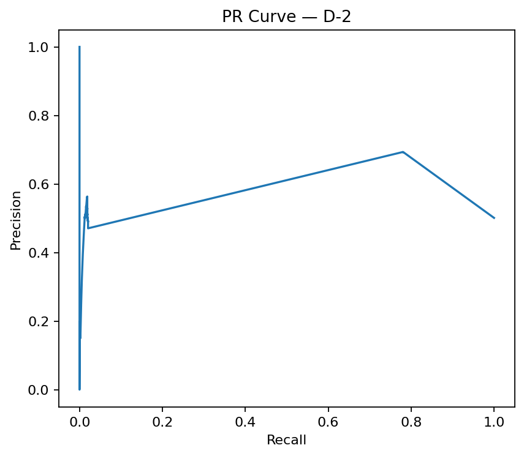

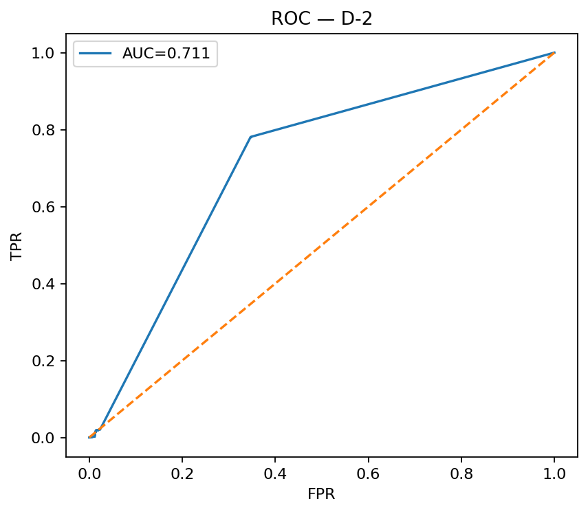
## 4) How It Works (Brief)
1. **Data** via KaggleHub; detect train/test + labels; synthetic timestamps when needed.
2. **Preprocess** numeric-only, drop NaN/Inf rows, remove low-variance columns, align to min feature count, enrich features (orig + diff + rolling std).
3. **Train** a global LSTM autoencoder; **fine-tune** per series on its train windows.
4. **Score** windows using blended top-k error stats on raw & diff; smooth.
5. **Threshold** by `best_f1` / `precision_floor` (labeled) or train quantile (unlabeled).
6. **Post-process** predictions (de-island, merge gap, dilate), write per-series CSVs & plots, plus unified `ALL_EVENTS.csv`.
## 5) Tables & CSVs
- **TOP10_by_F1.csv**
- **BOTTOM10_by_F1.csv**
- **batch_summary.csv**
- **ALL_EVENTS.csv**
## 6) Tuning Cheatsheet
- **More precision**: use `precision_floor`, raise `TARGET_PRECISION`; increase `MIN_EVENT_LEN`, reduce `MERGE_GAP`, disable `DILATE_NEIGHBOR`.
- **More recall**: keep `best_f1`, lower `MIN_EVENT_LEN`, allow dilation; consider smaller smoothing/thresholds.
## 7) License & Acknowledgments
- Choose a license (e.g., MIT).
- Datasets: NASA SMAP & MSL; thanks to Telemanom lineage and community benchmarks.
